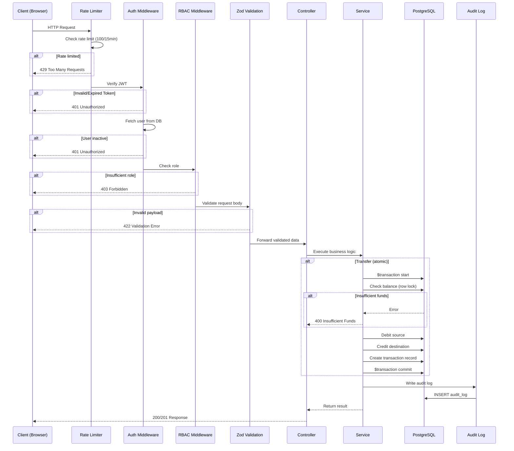
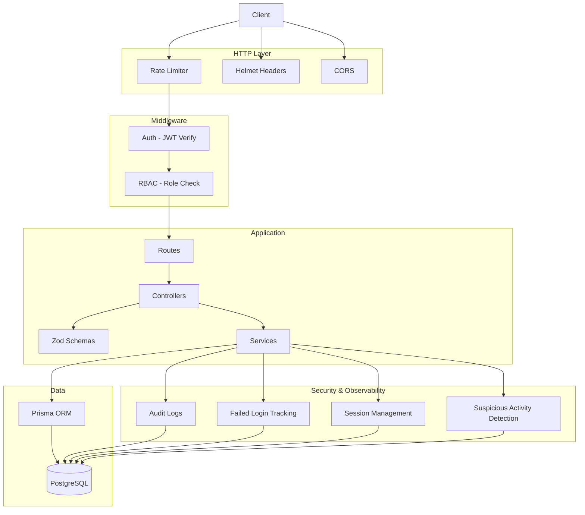
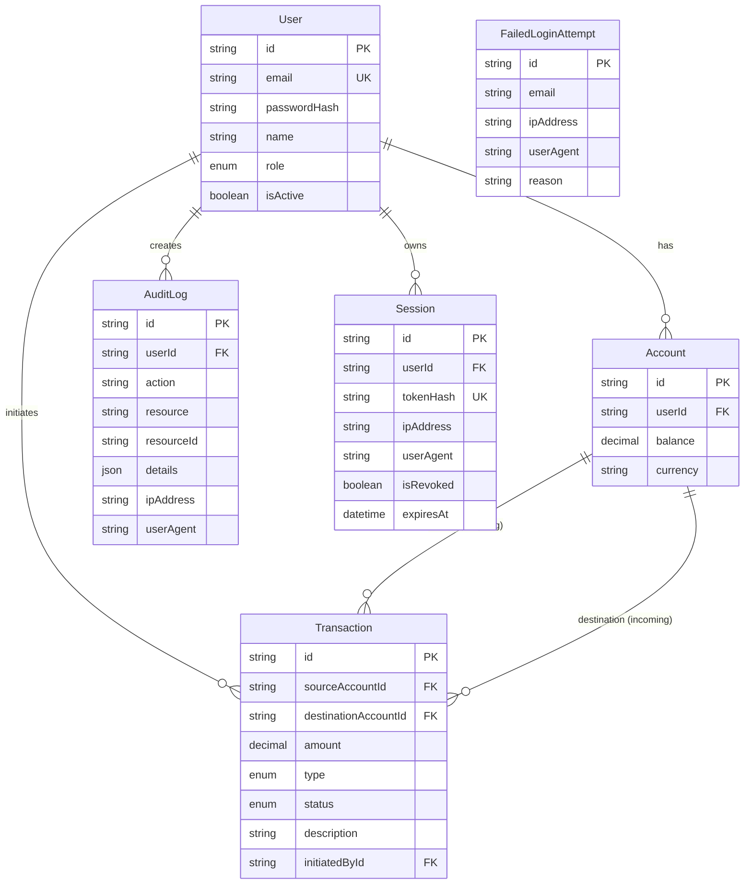

# Architecture

## Request Flow

```mermaid
sequenceDiagram
    participant Client as Client (Browser)
    participant RL as Rate Limiter
    participant Auth as Auth Middleware
    participant RBAC as RBAC Middleware
    participant Val as Zod Validation
    participant Ctrl as Controller
    participant Svc as Service
    participant DB as PostgreSQL
    participant Audit as Audit Log

    Client->>RL: HTTP Request
    RL->>RL: Check rate limit (100/15min)
    alt Rate limited
        RL-->>Client: 429 Too Many Requests
    end

    RL->>Auth: Verify JWT
    alt Invalid/Expired Token
        Auth-->>Client: 401 Unauthorized
    end

    Auth->>Auth: Fetch user from DB
    alt User inactive
        Auth-->>Client: 401 Unauthorized
    end

    Auth->>RBAC: Check role
    alt Insufficient role
        RBAC-->>Client: 403 Forbidden
    end

    RBAC->>Val: Validate request body
    alt Invalid payload
        Val-->>Client: 422 Validation Error
    end

    Val->>Ctrl: Forward validated data

    Ctrl->>Svc: Execute business logic

    alt Transfer (atomic)
        Svc->>DB: $transaction start
        Svc->>DB: Check balance (row lock)
        alt Insufficient funds
            DB-->>Svc: Error
            Svc-->>Ctrl: 400 Insufficient Funds
        end
        Svc->>DB: Debit source
        Svc->>DB: Credit destination
        Svc->>DB: Create transaction record
        Svc->>DB: $transaction commit
    end

    Svc->>Audit: Write audit log
    Audit->>DB: INSERT audit_log

    Svc-->>Ctrl: Return result
    Ctrl-->>Client: 200/201 Response
```

## Layer Architecture

```mermaid
graph TD
    subgraph "HTTP Layer"
        RL[Rate Limiter]
        Hel[Helmet Headers]
        CORS[CORS]
    end

    subgraph "Middleware"
        AUTH[Auth - JWT Verify]
        RBAC[RBAC - Role Check]
    end

    subgraph "Application"
        ROUTES[Routes]
        CTRL[Controllers]
        VAL[Zod Schemas]
        SVC[Services]
    end

    subgraph "Data"
        PR[Prisma ORM]
        PG[(PostgreSQL)]
    end

    subgraph "Security & Observability"
        AUDIT[Audit Logs]
        FAIL[Failed Login Tracking]
        SESS[Session Management]
        SUSP[Suspicious Activity Detection]
    end

    Client --> RL
    Client --> CORS
    Client --> Hel
    RL --> AUTH
    AUTH --> RBAC
    RBAC --> ROUTES
    ROUTES --> CTRL
    CTRL --> VAL
    CTRL --> SVC
    SVC --> PR
    SVC --> AUDIT
    SVC --> FAIL
    SVC --> SESS
    SVC --> SUSP
    PR --> PG
    AUDIT --> PG
    FAIL --> PG
    SESS --> PG
    SUSP --> PG
```

## Database Schema

```mermaid
erDiagram
    User ||--o{ Account : has
    User ||--o{ AuditLog : creates
    User ||--o{ Transaction : initiates
    User ||--o{ Session : owns
    Account ||--o{ Transaction : "source (outgoing)"
    Account ||--o{ Transaction : "destination (incoming)"

    User {
        string id PK
        string email UK
        string passwordHash
        string name
        enum role
        boolean isActive
    }

    Account {
        string id PK
        string userId FK
        decimal balance
        string currency
    }

    Transaction {
        string id PK
        string sourceAccountId FK
        string destinationAccountId FK
        decimal amount
        enum type
        enum status
        string description
        string initiatedById FK
    }

    AuditLog {
        string id PK
        string userId FK
        string action
        string resource
        string resourceId
        json details
        string ipAddress
        string userAgent
    }

    FailedLoginAttempt {
        string id PK
        string email
        string ipAddress
        string userAgent
        string reason
    }

    Session {
        string id PK
        string userId FK
        string tokenHash UK
        string ipAddress
        string userAgent
        boolean isRevoked
        datetime expiresAt
    }
```
