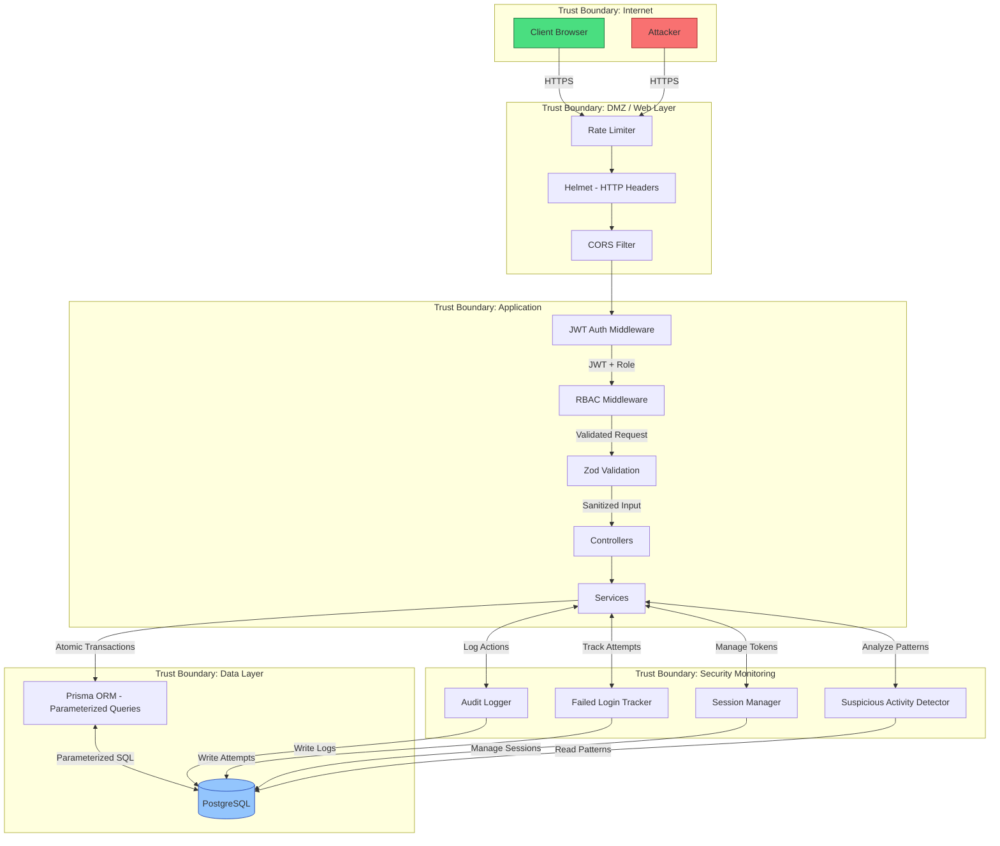
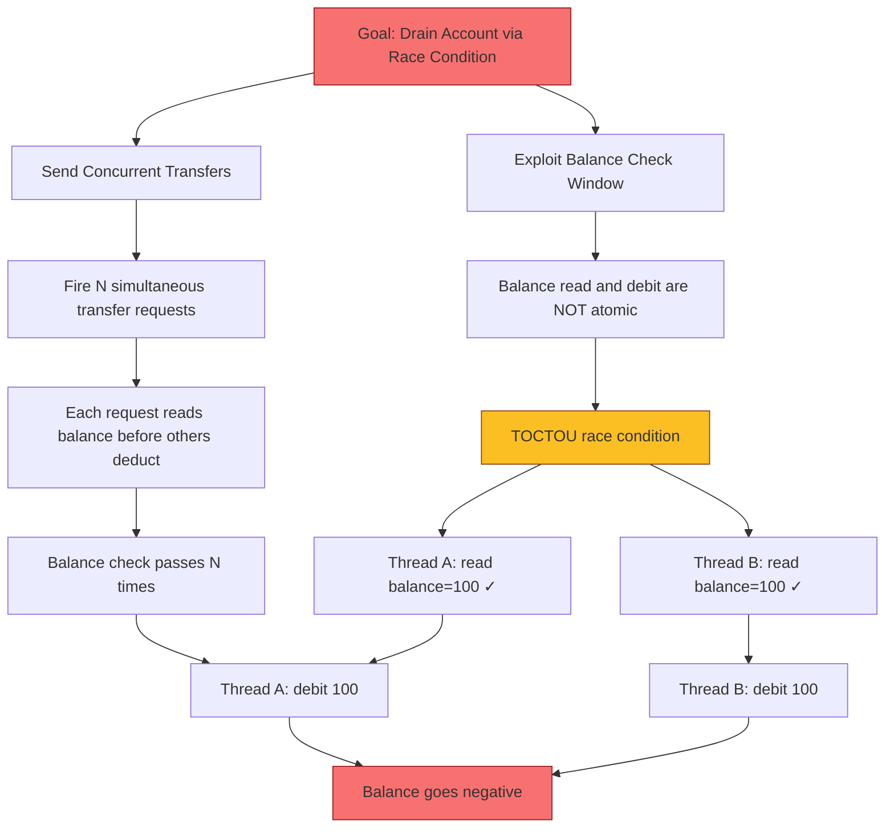
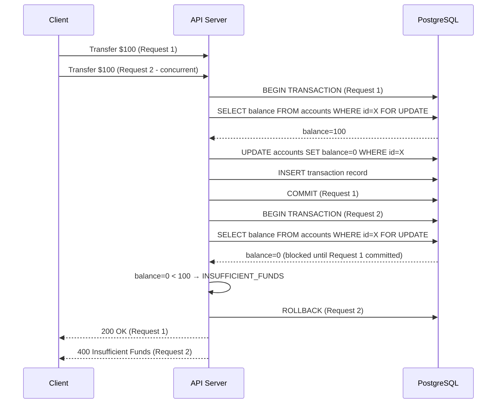

# Threat Model — SecBank API

## Data Flow Diagram with Trust Boundaries

## STRIDE Analysis

| Threat | Category | Attack Vector | Impact | Severity | Mitigation |
|---|---|---|---|---|---|
| **Spoofing** | Authentication | JWT secret guessed; weak passwords brute-forced; refresh token stolen | Attacker impersonates any user | High | bcrypt cost 12, 15min access tokens, rate limiting, failed login tracking |
| **Tampering** | Integrity | MITM alters transfer amount; race condition double-spend | Unauthorized fund movement | Critical | Atomic `$transaction` with row locking, Zod input validation |
| **Repudiation** | Non-repudiation | User denies transfer; no record of admin actions | Cannot prove who did what | Medium | Every state change writes to AuditLog in same DB transaction |
| **Info Disclosure** | Confidentiality | JWT leakage via XSS; verbose error stack traces | Session hijacking; internal exposure | High | Helmet headers, restricted CORS, sanitized production errors |
| **DoS** | Availability | Brute-force login; resource exhaustion | Database pool exhaustion; legitimate users locked out | Medium | Rate limiting (100/15min), failed login tracking with IP blocking thresholds |
| **Elevation of Privilege** | Authorization | JWT role tampering; missing RBAC check | Unauthorized admin access | Critical | DB-backed user fetch per request, `requireRole` middleware |

## Attack Tree: Transfer Double-Spend

## Mitigation: Atomic Transaction Flow

